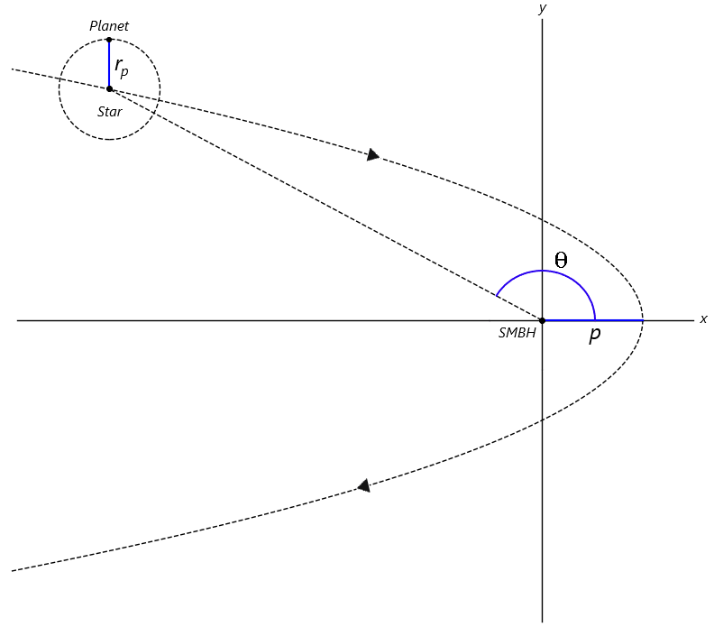
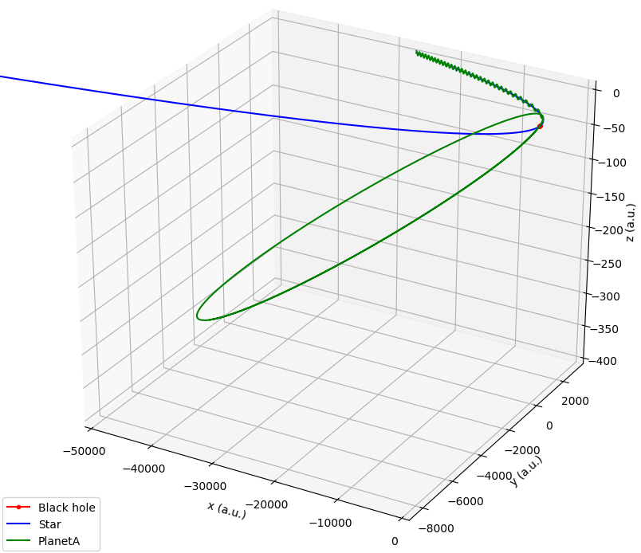

# Disruption-Of-Planetary-Systems
The code in this repository provides an interface for simulating three and four-body gravitational encounters between a supermassive black hole (SMBH), and a planetary system. The code will first generate the initial conditions of a system of bodies consisting of a planet in a circular orbit around a star, which in turn is in a parabolic orbit around the SMBH. The pericentre, *p*, of the parabolic orbit, and the distance between the planet and star, *r**p*, are used to generate these initial conditions.

  

Once the necessary conditions are generated, an AR-CHAIN integrator code is used to simulate a number of gravitational encounters. My project required the simulation of 8400 gravitational encounters. The outcomes of these encounters are then classified as a function of the initial parameters, and the semi-major axis and eccentricity of successfully captured planets is calculated.

  

